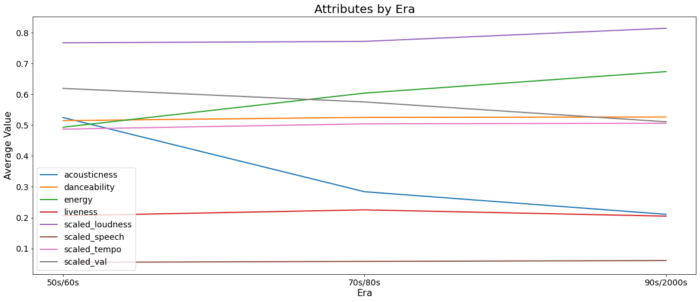
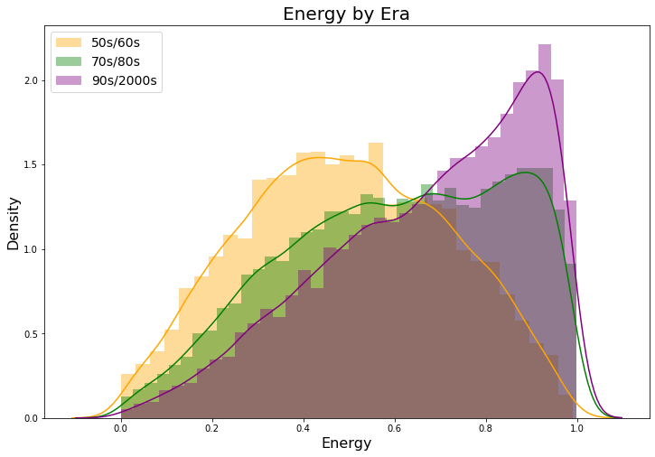

# Project 3: Multi-Classification
### Authors: Khyatee Desai and David Shin

## Overview

Spotify is always looking to create additional features and playlists to have users discover new artists from different genres and eras. New additions renew user for the app and have users looking to expand their assortment of music. The below analysis looks to prove that music can be classified by the time period they originate from by their musical attributes. 

## Business Problem

To develop the best features and playlists, we need to understand which features are most important in classifying music by time period. determining unemployment during a time of financial crisis. Once we understand which features are important, we can primarily monitor areas with the highest probability of showing employment loss, saving time and money.

## Data

We utilized a Kaggle Dataset that has Spotify music data from 1921-2020
*  https://www.kaggle.com/yamaerenay/spotify-dataset-19212020-160k-tracks

## Method

### Initial Data Setup

First had to join together the different tables that came in the original zip file and then bin our target variable into eras.

### Exploratory Data Analysis

In the attached notebook, we generated histograms and compared the variables in our data across the three eras. Also created a correlation plot to see how features interact with one another and with our target variable. After discovering the major variables that differed across the eras, we created visualizations of those specific variables. Our initial findings showed that popularity, acousticness, energy, loudness, and valence would most likely the most defining attributes of each era.

### Feature Engineering

We generated new features with feature interaction, natural logs, dummy variables, and polynomials.

### Models

Ran the below models with recursive feature elimination and GridSearch, in order to maximize results:
* Logistic
* KNN
* Decision Tree
* Random Forest
* XGBoost

## Results

Our initial thoughts prior to the project were that our models would perform poorly. However, our models were fairly accurate, boasting F1 scores in ranges of 0.65 - 0.72. 

## Conclusions

The clearest predictors of era classification were popularity, duration, loudness, and acousticness. Popularity is most likely due to the users of Spotify being from a younger age group that is more inclined to listen to music from more recent eras.  Because popularity isn't a reliable music attribute, future models would omit this variable from the data.

## Further Research

As prior mentioned, our next versions of our models would exclude popularity in order to determine classifications purely off musical features. This project is a first step into developing insights about song attributes. We can utilize this knowledge to further develop classifications and beginning to Other application is to use the insights from this project about song attributes as a launching point into unsupervised learning, for example clustering songs to make a recommendation engine 

## Navigation
├── README.md
├── images
│   ├── banner.jpg
│   ├── variables.png
│   ├── 
│   ├── ge 
│   ├── 
├── datasets
│   ├── datasets.zip
└── pickled
│   ├── grid_forest_model.pickle
│   ├── rfe_features.pickle
│   ├── xgboost_model.pickle
└── modeling_process.ipynb
