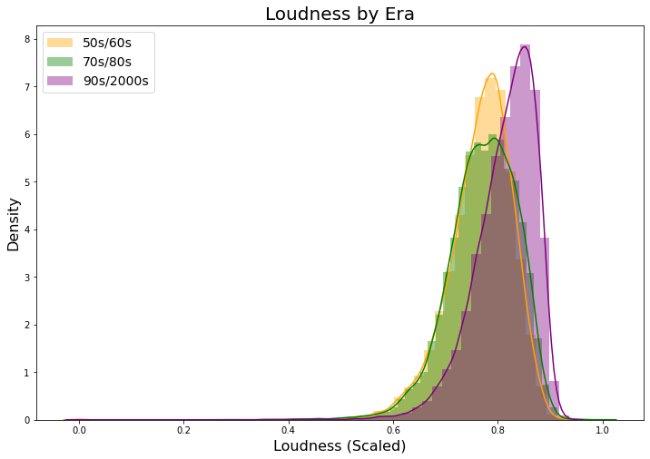
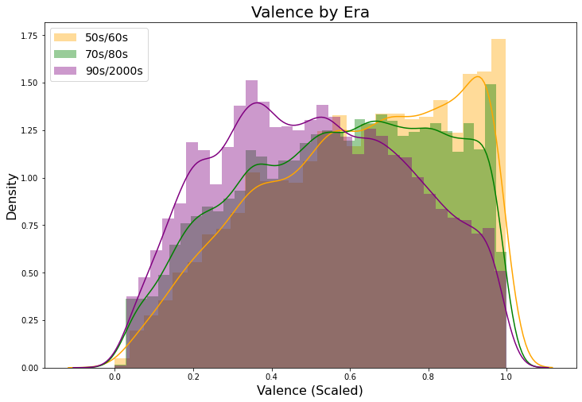
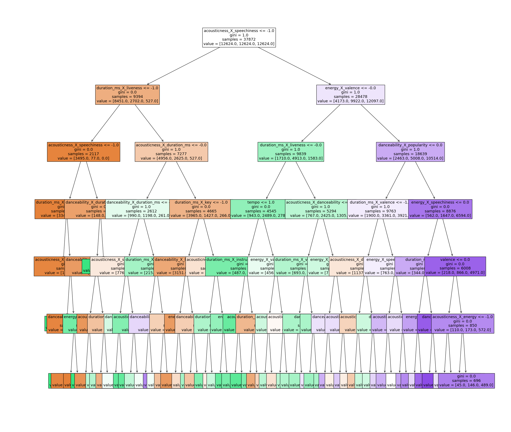

# Project 3: Multi-Classification
### Authors: Khyatee Desai and David Shin


## Overview

Spotify is always looking to create additional features and playlists to have users discover new artists from different genres and eras. New additions might cause existings users to renew their monthly subscriptions for the app and look to expand their assortment of music. The below analysis looks to prove that music can be classified by the time period they originate from by their musical attributes. New artist discovery through genre classification not only benefits users, but also artists and Spotify. Unknown artists benefit from more methods of discovery and Spotify potentially gains more revenue and more data.


## Business Problem

To develop the best features and playlists, we need to understand which features are most important in classifying music by time period. Creating new features could potentially drive customer subscription renewal and garner interest from new users. 

## Data

We utilized a Kaggle Dataset that has Spotify music data from 1921-2020
*  https://www.kaggle.com/yamaerenay/spotify-dataset-19212020-160k-tracks

The primary dataset we used contains song attributes for [+160k Spotify songs](https://www.kaggle.com/yamaerenay/spotify-dataset-19212020-160k-tracks), from 1921-2020. The Spotify data contains audio features for each track, they are as follows:

| KEY              | VALUE TYPE | VALUE DESCRIPTION                                                                                                                                                                                                                                                                                                                                                                                                                                                                                                                                                               |
|------------------|------------|---------------------------------------------------------------------------------------------------------------------------------------------------------------------------------------------------------------------------------------------------------------------------------------------------------------------------------------------------------------------------------------------------------------------------------------------------------------------------------------------------------------------------------------------------------------------------------|
| duration_ms      | int        | The duration of the track in milliseconds.                                                                                                                                                                                                                                                                                                                                                                                                                                                                                                                                      |
| key              | int        | The estimated overall key of the track. Integers map to pitches using standard Pitch Class notation . E.g. 0 = C, 1 = C♯/D♭, 2 = D, and so on. If no key was detected, the value is -1.                                                                                                                                                                                                                                                                                                                                                                                         |
| mode             | int        | Mode indicates the modality (major or minor) of a track, the type of scale from which its melodic content is derived. Major is represented by 1 and minor is 0.                                                                                                                                                                                                                                                                                                                                                                                                                 |
| time_signature   | int        | An estimated overall time signature of a track. The time signature (meter) is a notational convention to specify how many beats are in each bar (or measure).                                                                                                                                                                                                                                                                                                                                                                                                                   |
| acousticness     | float      | A confidence measure from 0.0 to 1.0 of whether the track is acoustic. 1.0 represents high confidence the track is acoustic. The distribution of values for this feature look like this:#                                                                                                                                                                                                                                                                                                                                                                                       |
| danceability     | float      | Danceability describes how suitable a track is for dancing based on a combination of musical elements including tempo, rhythm stability, beat strength, and overall regularity. A value of 0.0 is least danceable and 1.0 is most danceable. The distribution of values for this feature look like this:#                                                                                                                                                                                                                                                                       |
| energy           | float      | Energy is a measure from 0.0 to 1.0 and represents a perceptual measure of intensity and activity. Typically, energetic tracks feel fast, loud, and noisy. For example, death metal has high energy, while a Bach prelude scores low on the scale. Perceptual features contributing to this attribute include dynamic range, perceived loudness, timbre, onset rate, and general entropy. The distribution of values for this feature look like this:#                                                                                                                          |
| instrumentalness | float      | Predicts whether a track contains no vocals. “Ooh” and “aah” sounds are treated as instrumental in this context. Rap or spoken word tracks are clearly “vocal”. The closer the instrumentalness value is to 1.0, the greater likelihood the track contains no vocal content. Values above 0.5 are intended to represent instrumental tracks, but confidence is higher as the value approaches 1.0. The distribution of values for this feature look like this:#                                                                                                                 |
| liveness         | float      | Detects the presence of an audience in the recording. Higher liveness values represent an increased probability that the track was performed live. A value above 0.8 provides strong likelihood that the track is live. The distribution of values for this feature look like this:#                                                                                                                                                                                                                                                                                            |
| loudness         | float      | The overall loudness of a track in decibels (dB). Loudness values are averaged across the entire track and are useful for comparing relative loudness of tracks. Loudness is the quality of a sound that is the primary psychological correlate of physical strength (amplitude). Values typical range between -60 and 0 db. The distribution of values for this feature look like this:#                                                                                                                                                                                       |
| speechiness      | float      | Speechiness detects the presence of spoken words in a track. The more exclusively speech-like the recording (e.g. talk show, audio book, poetry), the closer to 1.0 the attribute value. Values above 0.66 describe tracks that are probably made entirely of spoken words. Values between 0.33 and 0.66 describe tracks that may contain both music and speech, either in sections or layered, including such cases as rap music. Values below 0.33 most likely represent music and other non-speech-like tracks. The distribution of values for this feature look like this:# |
| valence          | float      | A measure from 0.0 to 1.0 describing the musical positiveness conveyed by a track. Tracks with high valence sound more positive (e.g. happy, cheerful, euphoric), while tracks with low valence sound more negative (e.g. sad, depressed, angry). The distribution of values for this feature look like this:#                                                                                                                                                                                                                                                                  |
| tempo            | float      | The overall estimated tempo of a track in beats per minute (BPM). In musical terminology, tempo is the speed or pace of a given piece and derives directly from the average beat duration. The distribution of values for this feature look like this:#                                                                                                                                                                                                                                                                                                                         |
| id               | string     | The Spotify ID for the track.                                                                                                                                                                                                                                                                                                                                                                                                                                                                                                                                                   |
| uri              | string     | The Spotify URI for the track.                                                                                                                                                                                                                                                                                                                                                                                                                                                                                                                                                  |
| track_href       | string     | A link to the Web API endpoint providing full details of the track.                                                                                                                                                                                                                                                                                                                                                                                                                                                                                                             |
| analysis_url     | string     | An HTTP URL to access the full audio analysis of this track. An access token is required to access this data.                                                                                                                                                                                                                                                                                                                                                                                                                                                                   |
| type             | string     | The object type: “audio_features”                                                                                                                                                                                                     
## Method

### Initial Data Setup

First had to join together the different tables that came in the original zip file and then bin our target variable into eras.

### Exploratory Data Analysis


In the attached notebook, we generated histograms and compared the variables in our data across the three eras. Also created a correlation plot to see how features interact with one another and with our target variable. After discovering the major variables that differed across the eras, we created visualizations of those specific variables. Our initial findings showed that popularity, acousticness, energy, loudness, and valence would most likely the most defining attributes of each era.





### Feature Engineering

We generated new features with feature interaction, natural logs, dummy variables, and polynomials.

### Models

Ran the below models with recursive feature elimination and GridSearch, in order to maximize results:
* Logistic
* KNN
* Decision Tree
* Random Forest
* XGBoost



### Evaluation

Tested each model results for F1, recall, and accuracy. We concluded that F1 score would take most importance in our scenario because false positives aren't necessarily the worst-case scenario and might actually be one of the features we want to look into further because artists might replicate songs from other eras. 

## Results

Our results were in the form of evaluation metrics, model coefficients, and feature importance. Our initial thoughts prior to the project were that our models would perform poorly. However, our models were fairly accurate, boasting F1 scores in ranges of 0.65 - 0.72. The clearest predictors of era classification were popularity, duration, loudness, and acousticness. Popularity is most likely due to the users of Spotify being from a younger age group that is more inclined to listen to music from more recent eras.  Because popularity isn't a reliable music attribute, future models would omit this variable from the data.

## Conclusions

The best performing models were the KNN and XGBoost model. Our model evaluations and feature importance show that there are certain characteristics that can assist in determining the time period a song originated from. More recent eras tend to have more popular songs and shorter songs as well, which are not necessarily audio characteristics of the music but can also have underlying meaning. 


## Further Research

As prior mentioned, our next versions of our models would exclude popularity in order to determine classifications purely off musical features. Also, we could potentially work in conjunction with a music expert to better define music "eras" that might allow for clearer distinction in attributes. Overall, this project is a first step into something more. By developing insights about song attributes. We can further develop time-period classifications. These models serve as a beginning to unsupervised learning. Through unsupervised learning, we can discover some new patterns with no pre-defined eras.

## Repository Structure
```
├── README.md
├── data
│   ├── datasets.zip
├── images
│   ├── acoustic.png
│   ├── attributes.png
│   ├── banner.jpg
│   ├── energy.png 
│   ├── loudness.png
│   ├── pop.png
│   ├── spothome.png
│   ├── tree_plot.png
│   ├── valence.png
└── pickled
│   ├── grid_forest_model.pickle
│   ├── rfe_features.pickle
│   ├── xgboost_model.pickle
└── modeling_process.ipynb
