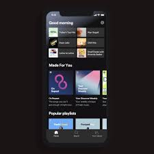
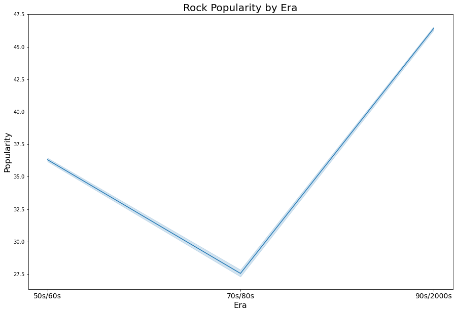
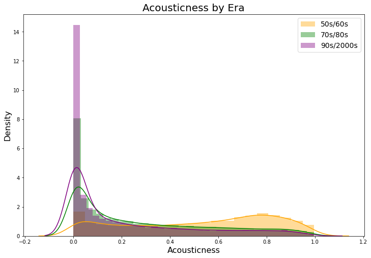

# Project 3: Multi-Classification
### Authors: Khyatee Desai and David Shin


## Overview

Spotify is always looking to create additional features and playlists to have users discover new artists from different genres and eras. New additions might cause existings users to renew their monthly subscriptions for the app and look to expand their assortment of music. The below analysis looks to prove that music can be classified by the time period they originate from by their musical attributes. New artist discovery through genre classification not only benefits users, but also artists and Spotify. Unknown artists benefit from more methods of discovery and Spotify potentially gains more revenue and more data.



## Business Problem

To develop the best features and playlists, we need to understand which features are most important in classifying music by time period. Creating new features could potentially drive customer subscription renewal and garner interest from new users. 

## Data

We utilized a Kaggle Dataset that has Spotify music data from 1921-2020
*  https://www.kaggle.com/yamaerenay/spotify-dataset-19212020-160k-tracks

## Method

### Initial Data Setup

First had to join together the different tables that came in the original zip file and then bin our target variable into eras.

### Exploratory Data Analysis


In the attached notebook, we generated histograms and compared the variables in our data across the three eras. Also created a correlation plot to see how features interact with one another and with our target variable. After discovering the major variables that differed across the eras, we created visualizations of those specific variables. Our initial findings showed that popularity, acousticness, energy, loudness, and valence would most likely the most defining attributes of each era.





### Feature Engineering

We generated new features with feature interaction, natural logs, dummy variables, and polynomials.

### Models

Ran the below models with recursive feature elimination and GridSearch, in order to maximize results:
* Logistic
* KNN
* Decision Tree
* Random Forest
* XGBoost

### Evaluation

Tested each model results for F1, recall, and accuracy. We concluded that F1 score would take most importance in our scenario because false positives aren't necessarily the worst-case scenario. Artists might replicate songs from other eras. 

## Results

Our results were in the form of evaluation metrics, model coefficients, and feature importance. Our initial thoughts prior to the project were that our models would perform poorly. However, our models were fairly accurate, boasting F1 scores in ranges of 0.65 - 0.72. The clearest predictors of era classification were popularity, duration, loudness, and acousticness. Popularity is most likely due to the users of Spotify being from a younger age group that is more inclined to listen to music from more recent eras.  Because popularity isn't a reliable music attribute, future models would omit this variable from the data.

## Conclusions

The best performing models were the KNN and XGBoost model. Our model evaluations and feature importance show that there are certain characteristics that can assist in determining the time period a song originated from. More recent eras tend to have more popular songs and shorter songs as well, which are not necessarily audio characteristics of the music but can also have underlying meaning. 


## Further Research

As prior mentioned, our next versions of our models would exclude popularity in order to determine classifications purely off musical features. Also, we could potentially work in conjunction with a music expert to better define music "eras" that might allow for clearer distinction in attributes. Overall, this project is a first step into something more. By developing insights about song attributes. We can further develop time-period classifications. These models serve as a beginning to unsupervised learning. Through unsupervised learning, we can discover some new patterns with no pre-defined eras.

```
## Navigation
├── README.md
├── data
│   ├── datasets.zip
├── images
│   ├── acoustic.png
│   ├── attributes.png
│   ├── banner.jpg
│   ├── energy.png 
│   ├── loudness.png
│   ├── pop.png
│   ├── spothome.png
│   ├── treeplot.png
│   ├── valence.png
└── pickled
│   ├── grid_forest_model.pickle
│   ├── rfe_features.pickle
│   ├── xgboost_model.pickle
└── modeling_process.ipynb
